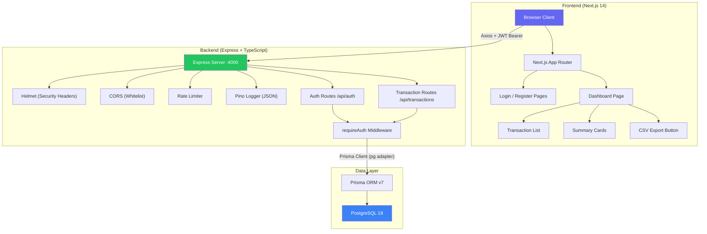

# Tetra Finance — Architecture Overview

## System Architecture



## Tech Stack

| Layer        | Technology                              |
|--------------|-----------------------------------------|
| Frontend     | Next.js 14 (App Router), Tailwind CSS   |
| HTTP Client  | Axios with JWT interceptor              |
| Icons        | Lucide React                            |
| Backend      | Express.js, TypeScript                  |
| ORM          | Prisma 7 with `@prisma/adapter-pg`      |
| Database     | PostgreSQL 18                           |
| Auth         | JWT (Bearer), bcryptjs (password hash)  |
| Security     | Helmet, CORS, express-rate-limit        |
| Logging      | Pino + pino-http (structured JSON)      |
| CI/CD        | GitHub Actions                          |

## Multi-Tenancy Model

Every `User` belongs to exactly one `Org` (organization). Every `Transaction` is scoped to an `Org` via `orgId`. The `requireAuth` middleware extracts the `orgId` from the JWT token and injects it into `req.user`. All database queries filter by `orgId` to guarantee strict tenant isolation.

```
Org (1) ──→ (N) User
Org (1) ──→ (N) Transaction
```

## Authentication Flow

1. **Register:** Client POSTs `{ orgName, email, password }` → API creates `Org` + `User` atomically → returns JWT.
2. **Login:** Client POSTs `{ email, password }` → API verifies bcrypt hash → returns JWT.
3. **Protected Routes:** Axios interceptor attaches `Authorization: Bearer <token>` to every request. The `requireAuth` middleware verifies the token and populates `req.user`.

## Security Measures

- **Helmet:** Sets CSP, HSTS, X-Frame-Options, X-Content-Type-Options headers.
- **CORS:** Whitelists only the `FRONTEND_URL` origin.
- **Rate Limiting:** Global (100 req/15min) and auth-specific (10 req/15min).
- **Password Hashing:** bcryptjs with 10 salt rounds.
- **Error Handling:** Centralized handler strips stack traces from responses.
